  

<h3 align="center">tarek_solamy</h3>

---

 Welcome to the GitHub repository for my personal online portfolio. This repository is a comprehensive display of my coding prowess, reflecting both my academic and personal projects. It's a window into my journey as a developer, a storyteller, and an explorer of the great outdoors.
      

## 📝 Table of Contents

- [About](#about)
- [Navigating the Portfolio](#navigating_the_portfolio)
- [Built Using](#built_using)
- [TODO](../TODO.md)
- [Contributing](../CONTRIBUTING.md)
- [Authors](#authors)
- [Acknowledgments](#acknowledgement)

## 🧐 About 
The portfolio is divided into several sections:

### Home
The landing page of my portfolio, providing a warm welcome and a brief introduction to what visitors can expect to find.

### Coding Projects
A detailed exhibition of my coding journey, with projects ranging from simple scripts to complex, multi-faceted applications. Each project comes with its own README, explaining the objectives, the technologies used, and the lessons learned.

### Story Writing
An anthology of my written works, showcasing my talent in crafting engaging narratives. Here, you can find short stories, serialized fiction, and insights into my writing process.

### Outdoor Exploration
This section includes a interactive map to show that locations in nature that I explored and ones that I want to do so in the future.

### Game Development
A peek into my creativity and technical ability, this section details the games I've developed, including design documents, code snippets, and playable demos.

### Contact Me
A simple page with my contact information and social media links, making it easy for potential collaborators, recruiters, or fellow enthusiasts to reach out.

## 🏁 Navigating the Portfolio 

The portfolio is built with [HTML, CSS, JavaScript, Python, Flask] and can be accessed through [https://github.com/tarek-debug/Online_Portfolio/].

### Flask-MongoDB Usage:
- You can access the documentation files for the python codes in the "doc" folder
- This diagrams helps to illustrate the relation between my website and mongoDB database.
routes.py:

```mermaid
graph TD
    subgraph Frontend
    Home[/home/]
    AboutMe[/about_me/]
    Academic[/academic/]
    Personal[/personal/]
    StoryWriting[/story_writing/]
    ExploringOutdoor[/exploring_the_outdoor/]
    GameDevelopment[/game_development/]
    Contact[/contact/]
    ImageAttribution[/image_attribution/]
    end

    subgraph Backend
    GetSentences[/get_sentences/] 
    GetCircularData[/get_circular_data/] 
    GetProjects[/get_projects/] 
    Login[/login/] 
    Logout[/logout/] 
    end

    Home -->|Read/Write| MongoDB[(MongoDB)]
    GetSentences -->|Read| MongoDB
    GetCircularData -->|Read| MongoDB
    GetProjects -->|Read| MongoDB
    Login -->|Read/Write| MongoDB
    Logout -->|Write| MongoDB
    AboutMe -->|Read| MongoDB
    Academic -->|Read| MongoDB
    Personal -->|Read| MongoDB
    StoryWriting -->|Read| MongoDB
    ExploringOutdoor -->|Read| MongoDB
    GameDevelopment -->|Read| MongoDB
    Contact -->|Read| MongoDB
    ImageAttribution -->|Read| MongoDB

    style MongoDB fill:#f96,stroke:#333,stroke-width:2px

```

edit_pages.py:

```mermaid
graph LR
    subgraph Endpoints
        AddOrUpdateSentence(Add/Update Sentence) -->|Write| DB[(MongoDB)]
        DeleteSentence(Delete Sentence) -->|Write| DB
        AddBar(Add Bar) -->|Write| DB
        EditBar(Edit Bar) -->|Write| DB
        RemoveBar(Remove Bar) -->|Write| DB
        EditAbout(Edit About) -->|Write| DB
        EditAboutMePhoto(Edit About Me Photo) -->|Write| DB
        EditResume(Edit Resume) -->|Write| DB
        DownloadResume(Download Resume) -->|Read| DB
        EditAcademicTable(Edit Academic Table) -->|Write| DB
        EditPersonalTable(Edit Personal Table) -->|Write| DB
        EditStoryWritingTable(Edit Story Writing Table) -->|Write| DB
        EditGameDevTable(Edit Game Dev Table) -->|Write| DB
        EditHome(Edit Home) -->|Write| DB
        NewContact(New Contact) -->|Write| DB
        DeleteContact(Delete Contact) -->|Write| DB
        EditPersonalProjects(Edit Personal Projects) -->|Write| DB
        EditAcademicPageText(Edit Academic Page Text) -->|Write| DB
        EditPersonalProjectsPageText(Edit Personal Projects Page Text) -->|Write| DB
        EditGameDevPageText(Edit Game Dev Page Text) -->|Write| DB
        EditOutdoorPageText(Edit Outdoor Page Text) -->|Write| DB
        EditStoriesMainPageText(Edit Stories Main Page Text) -->|Write| DB
        HandleMapMarker(Handle Map Marker) -->|Write| DB
        EditImgAttribTable(Edit Img Attrib Table) -->|Write| DB
        EditAcademicProjectsPages(Edit Academic Projects Pages) -->|Write| DB
        EditPersonalProjectsPages(Edit Personal Projects Pages) -->|Write| DB
        EditGameDevMainPages(Edit Game Dev Main Pages) -->|Write| DB
        EditGamesPages(Edit Games Pages) -->|Write| DB
    end

    style DB fill:#f96,stroke:#333,stroke-width:2px

```

### Prerequisites

The libraries and frameworks needed for this website can be found in requirements.txt

### Installing
git clone https://github.com/tarek-debug/Online_Portfolio.git

## ⛏️ Built Using 

- [MongoDB](https://www.mongodb.com/) - Database
- [Flask](https://flask.palletsprojects.com/en/3.0.x/) - Server Framework
- [NodeJs](https://nodejs.org/en/) - Server Environment
- [Amazon AWS EC2](https://aws.amazon.com/ec2/) - Deployment
- [Leaflet](https://leafletjs.com/) - Interactive Map

The application is deployed on an Amazon AWS EC2 instance, ensuring high availability and scalability. EC2's flexible and secure environment supports the Flask application, allowing for efficient management of traffic and resources.

## 🚀 Deployment 

The portfolio website is deployed on an Amazon AWS EC2 instance which provides a reliable and scalable cloud computing capacity. The deployment process involves setting up the EC2 instance, configuring the security groups, installing the necessary software stack, and launching the Flask application to serve the portfolio to users worldwide. Detailed steps for deployment can be found in the DEPLOYMENT.md file.

## 📄 License 

This project is licensed under the MIT License - see the [LICENSE.md](LICENSE) file for details.

## 📈 Contributing 

Contributions are what make the open-source community such an amazing place to learn, inspire, and create. Any contributions you make are **greatly appreciated**.

Please refer to the [CONTRIBUTING.md](../CONTRIBUTING.md) file for detailed instructions on how to contribute, code of conduct, and the process for submitting pull requests to us.

## ✍️ Authors 

- [@tarek_solamy](https://github.com/tarek-debug) - Idea & Initial work

## 🎉 Acknowledgements 

- Hat tip to anyone whose code was used
- Inspiration
- References

